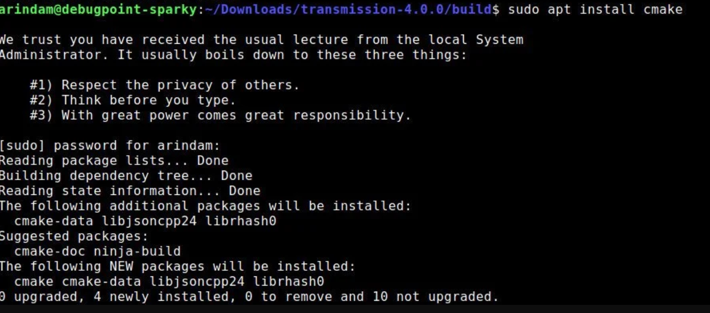
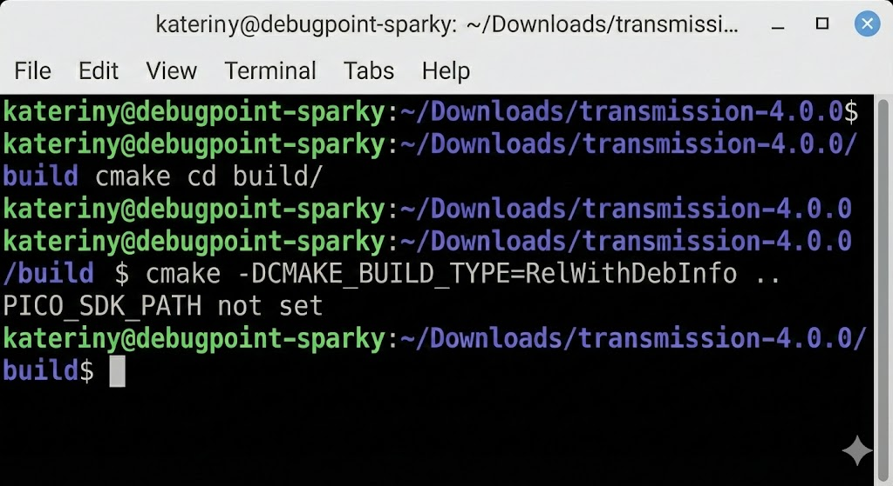

#  Melhoria da Documentação – Erros Comuns

##  Objetivo

Esta seção tem como objetivo auxiliar novos usuários do **Pico SDK** a identificar e resolver rapidamente problemas frequentes encontrados durante o desenvolvimento, reduzindo o tempo de configuração do ambiente e facilitando o processo de compilação e execução dos projetos.

O foco é apoiar principalmente **alunos iniciantes**, que costumam enfrentar dificuldades relacionadas à configuração do ambiente, uso do CMake e inclusão correta de bibliotecas.

---

##  Índice

* [Erros de Configuração do Ambiente](#erros-de-configuração-do-ambiente)
* [Erros de Compilação](#erros-de-compilação)
* [Uso Incorreto de Bibliotecas](#uso-incorreto-de-bibliotecas)
* [Metodologia Utilizada](#-metodologia-utilizada)
* [Benefícios para a Próxima Turma](#-benefícios-para-a-próxima-turma)

---

##  Erros de Configuração do Ambiente

###  Erro 1: `cmake: command not found`


**Descrição**
Ao tentar compilar o projeto, o terminal informa que o comando `cmake` não foi reconhecido.

**Causa**
O CMake não está instalado ou não foi adicionado corretamente às variáveis de ambiente do sistema.

**Solução**

* Verifique se o CMake está instalado:

  ```bash
  cmake --version
  ```
* Caso não esteja instalado:

  * Instale o CMake



  * Marque a opção **“Add CMake to system PATH”** durante a instalação
* Reinicie o terminal ou o computador após a instalação

---

###  Erro 2: `PICO_SDK_PATH not set`


**Descrição**
O CMake retorna erro informando que a variável `PICO_SDK_PATH` não está definida.

**Causa**
A variável de ambiente que aponta para o diretório do Pico SDK não foi configurada corretamente.

**Solução**

* Defina a variável de ambiente:

  * **Nome:** `PICO_SDK_PATH`
  * **Valor:** caminho onde o Pico SDK foi clonado
* Exemplo:

  ```text
  C:\pico\pico-sdk
  ```
* Confirme no terminal:

  ```bash
  echo %PICO_SDK_PATH%
  ```

---

##  Erros de Compilação

###  Erro 3: Build não gera arquivos (`.uf2` ou `.elf`)

**Descrição**
O comando de build é executado, mas os arquivos finais não são gerados.

**Causa**

* Diretório `build` não criado corretamente
* Execução do CMake fora do diretório correto

**Solução**
Execute os comandos na ordem correta:

```bash
mkdir build
cd build
cmake ..
make
```

---

###  Erro 4: Programa não executa no Raspberry Pi Pico

**Descrição**
O código compila, mas não executa no Pico após copiar o arquivo `.uf2`.

**Causa**

* Pico não estava em modo **BOOTSEL**
* Arquivo `.uf2` incorreto
* Pino configurado incorretamente no código

**Solução**

* Conecte o Pico ao computador segurando o botão **BOOTSEL**
* Confirme se o arquivo `.uf2` copiado é o correto
* Verifique a configuração dos pinos no código-fonte

---

##  Uso Incorreto de Bibliotecas

###  Erro 5: Funções ou bibliotecas não reconhecidas

**Descrição**
Erro de compilação relacionado a funções ou bibliotecas inexistentes.

**Causa**

* Biblioteca não adicionada no `CMakeLists.txt`
* Inclusão incorreta no código (`#include`)

**Solução**

* Verifique se a biblioteca foi adicionada corretamente:

  ```cmake
  target_link_libraries(nome_do_projeto pico_stdlib hardware_pwm)
  ```
* Confirme os includes no código:

  ```c
  #include "hardware/pwm.h"
  ```

---

##  Metodologia Utilizada

Os erros documentados foram levantados com base:

* Nas dificuldades enfrentadas durante o desenvolvimento do projeto
* Em problemas recorrentes observados entre os alunos
* Em mensagens comuns retornadas pelo compilador e pelo CMake

---
